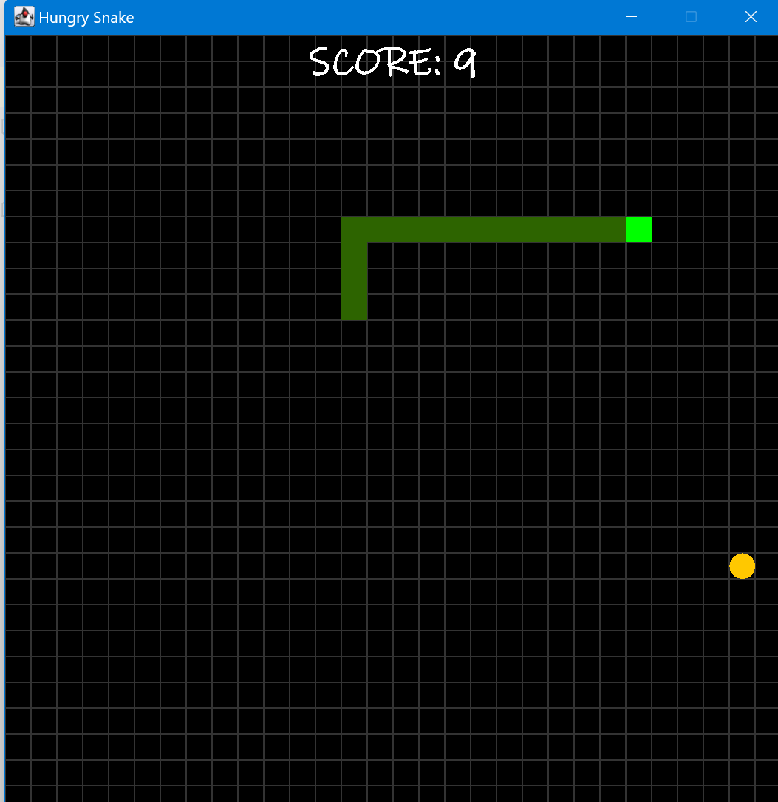

<h1>Hungry Snake using Java Swing</h1>
<h3>Introduction</h3>

This is a simple Snake game implemented in Java with the help of Swing and AWT libraries. The game allows players to control a snake and collect food items to increase their score. When the snake collides with the game borders or itself, the game ends, and the player can restart it by pressing the spacebar.
How to Play

    Use the arrow keys (Up, Down, Left, Right) to control the snake's direction.
    Move the snake to collect the orange food items to increase your score.
    Avoid colliding with the game borders or the snake's own body.
    When the game ends, press the spacebar to restart.
    

  
  
    

<h3>Game Features</h3>

    Snake grows longer as it collects food.
    Score is displayed on the screen.
    Game over message is shown when the snake collides.
    Player can restart the game by pressing the spacebar.
    Enter your name at the end to record your score.

<h3>Code Structure </h3>

The game is organized into two main classes:

    GameFrame: This class represents the game's main frame, where the GamePanel is added. It handles the game's window, title, and frame settings.

    GamePanel: This class represents the game's panel, where the game logic, graphics, and user interactions are handled. It contains methods for controlling the snake, checking for collisions, and drawing the game components.

<h3>How to Run</h3>

    Make sure you have Java installed on your computer.
    Compile the source files.
    Run the GameFrame class to start the game.

<h3>Additional Customization</h3>

You can customize the game further by adjusting the game's constants, such as screen size, delay, and colors in the GamePanel class. Feel free to modify the code to add more features or improve the gameplay.
Author

  <h1>Shahid Ali</h1>

<h4>Acknowledgments</h4>

    This game was created using Java and the Swing library.
    Inspiration and ideas were drawn from classic Snake games.

Enjoy playing the Snake Game! If you have any feedback or suggestions, please feel free to reach out.
